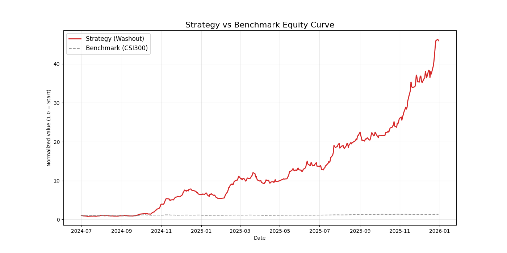

# Washout & Burst Strategy

This is a quantitative trading system designed to capture the **"Washout and Rebound"** (or "Washout & Burst") pattern in the A-share market, a pattern often associated with "Smart Money" or "Hot Money" movements. The system utilizes **ClickHouse** for high-performance full-market data storage, **Microsoft Qlib** for efficient data loading and feature engineering, and **LightGBM** for training ranking models. Its primary goal is to identify stocks with high breakout probability.

## Architecture

* **Data Source**: AkShare (East Money API)
* **Data Storage**: ClickHouse (High-performance OLAP database)
* **Quant Framework**: Microsoft Qlib (Data Loader, Factor Computation, Backtest Engine)
* **Core Model**: LightGBM (GBDT Ranking Model)
* **Strategy Logic**: TopK Dropout (Daily rotation holding the Top 5 stocks with the highest prediction scores)

## Requirements

Ensure the following Python libraries are installed:

```bash
pip install qlib clickhouse-driver pandas numpy lightgbm scikit-learn matplotlib akshare tqdm
```


# Workflow
Follow these steps to ingest data, train the model, and run the simulation.

## 1. Data Ingestion
Fetch full historical daily data for A-shares (Open, High, Low, Close, Volume, and Turnover Rate) from AkShare and persist it into ClickHouse.

## 2. Data Conversion
Extract the cleaned data from ClickHouse and convert it into the .bin binary format required by Qlib for efficient, high-speed processing.

## 3. Model Training

* **Train** the LightGBM model. The model utilizes specific factors such as Amplitude, Volume Shrinkage, Lower Shadow Ratio, and Turnover Rate.

* **Label**: T+1 Max Price Return / T+1 Close Price Return.

* **Loss Function**: MSE / Rank Loss (CSRankNorm).

## 4. Backtest Simulation
Run the trading simulation.

* **Period**: 2024.07 - 2025.12

* **Strategy**: Daily full-position rotation (Top 5 stocks).

* **Risk Control**: Automatically filters out "Limit-up at Open" (One-bar limit up) stocks that cannot be purchased.

## 5. Visualization
Generate an equity curve comparison chart to visualize the strategy's performance against the CSI 300 Benchmark.




# Performance Results
The following metrics are based on backtesting data from July 2024 to December 2025:

**Annualized Return**: 1284.47% (Benchmark during same period: 22.49%)

**Total Return**: 4493.12% (Benchmark during same period: 34.37%)

**Sharpe Ratio**: 4.6643 (Benchmark during same period: 1.1269)

**Max Drawdown**: -31.85% (Benchmark during same period: -15.66%)


## Analysis
The current strategy behaves as a typical "High-Beta Bull Market Amplifier."

**Pros**: It achieves astonishing excess returns when market sentiment is high, aggressively capturing upward momentum.

**Cons**: It suffers massive drawdowns during market downturns due to a lack of defensive mechanisms. It is currently a high-risk, high-reward system.

## Future Investigation & Assessment
Based on the deep attribution analysis, future development will focus on three core areas: Drawdown Control, Market Timing, and resolving Data Bias.

**Risk Management & Timing**

The biggest risk currently is "stubbornly holding top performers," operating at a full position even during market crashes.

  Market Regime Filter: Introduce the CSI 300 index as a market wind vane. If the index falls below the 20-day MA or MACD shows a death cross, the system will forcibly reduce positions or clear positions (go to cash).

  Stop-Loss Logic: Implement individual stock-level stop-loss mechanisms. If a single-day drop exceeds 5% or breaks key support, sell immediately intraday or at the next open.

**Model Robustness**

The current model is trained on data from 2021 to 2024, which may be overfit to recent market trends.

  Rolling Walk-forward: Adopt a "Sliding Window" training approach (e.g., train on the past 3 years to predict the next 6 months) to ensure the model adapts to changing market styles (Concept Drift).

  Extreme Market Stress Test: Backfill data for the 2015 Crash, 2018 Trade War, and Early 2024 Liquidity Crisis to verify the strategy's survival capability in bear markets.

**Factor Mining**

  Microstructure: Introduce minute-level data to calculate higher-frequency factors, such as "Capital Flow in the first 30 mins."

  Sentiment Factors: Combine price action with Sector Heat to filter out isolated pump-and-dump stocks and focus on legitimate sector leaders.
